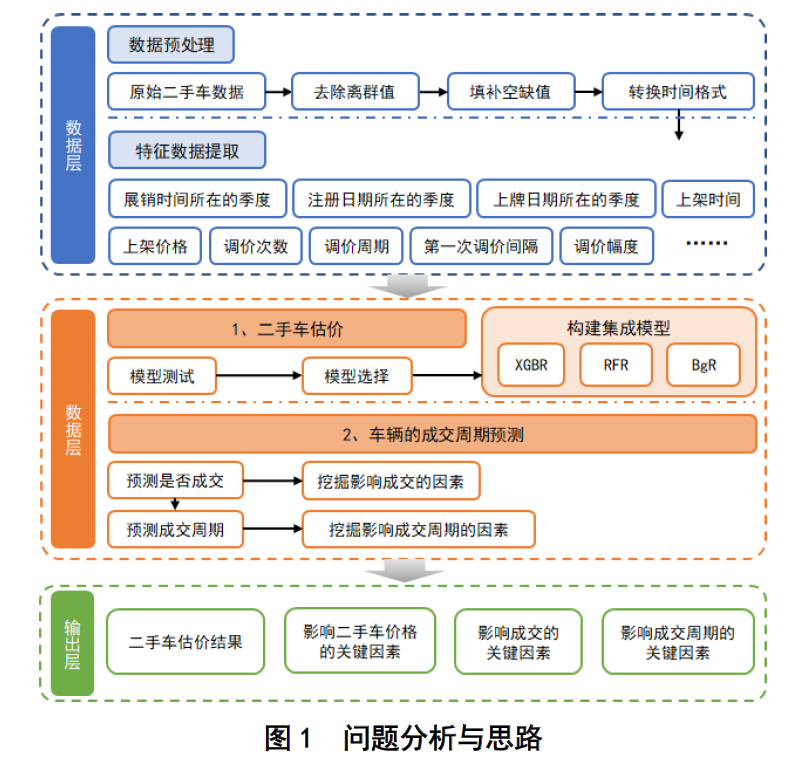
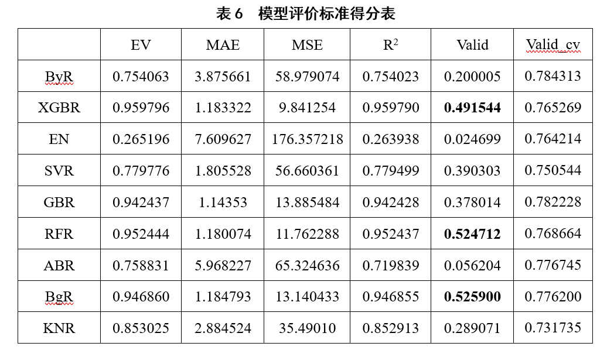
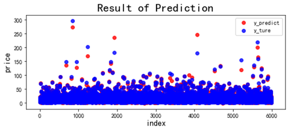
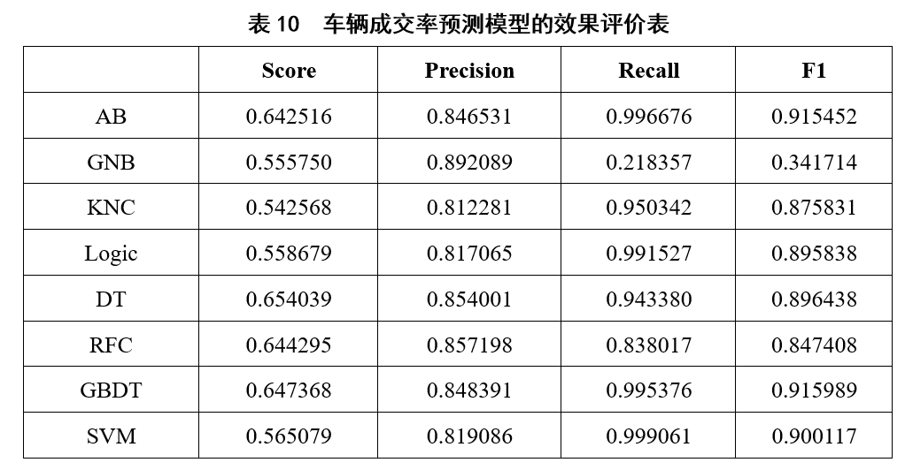
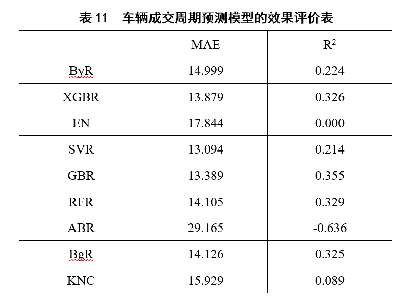

# 基于机器学习和多模型融合的二手车交易市场大数据挖掘

本项目通过赛事组委会提供的二手车交易样本数据，通过数据分析、信息挖掘等方式，采用机器学习与数学模型来分析二手车估价、交易周期的相关因素。具体问题如下：

- 问题1：基于给定的二手车交易样本数据（附件 1：估价训练数据），选用合适的估价方法，构建模型，预测二手车的零售交易价格。
- 问题2：结合附件 4“门店交易训练数据”对车辆的成交周期（从车辆上架到成交的时间长度，单位：天）进行分析，挖掘影响车辆成交周期的关键因素。假如需要加快门店在库车辆的销售速度，你们可 以结合这些关键因素采取哪些行之有效的手段，并进一步说明这些手段的适用条件和预期效果。
- 问题3：依据给出的样本数据集，提出还有哪些问题值得研究，并给出具体的研究思路？

针对问题一，主要实现对二手车交易价格的估计和预测。

- ①在数据层面最重要的是进行数据预处理，主要包括特征的筛选与转化、相关性分析、缺失值填补、数据清洗与统计，首先将部分日期型数据转化为数值型数据，接着通过随机森林算法成功对关键特征的缺失值完成填补，最终得到16个分类变量和13项数值变量，共计30000条可用的样本集数据。
- ②通过对9种机器学习算法的十次迭代，依据6个模型评价标准，筛选出XGBoost算法（XGBR）、随机森林算法（RFR）、装袋算法（BgR）等三类模型，对其进行集成操作后，得到“XGBR+RFR+BgR”集成模型，进而对二手车交易价格进行预测，该模型在给定的评价标准上达到0.630876。

针对问题二，主要实现对二手车交易成功率与成交周期的影响因素分析。

- ①补充了9个特征变量和2个目标变量；
- ②采用相关性的热力分布图，初步探索在门店交易特征变量、总体特征变量中影响二手车成交率和成交周期的主要因素；③通过8种机器学习的分类算法，进行十次迭代运算，参考4个模型的评价标准，选取梯度提升算法对二手车成交率的影响因素进行分析，结果发现车型id是影响成交率的最重要因素；④通过9种机器学习的回归算法，经过十次迭代运算，参考平均绝对误差（MAE）和判定系数（R2）等2个评价标准，选取梯度提升算法分析二手车成交周期的影响因素，结果发现调价周期是影响成交周期的首要因素，进而对其现实意义进行了探讨。

## 1.项目框架

## 2.程序说明
### 2.1 convert_to_num.py
分类变量编码代码（pycharm编写， 由.py格式导出），用于对数据中的分类变量进行编码（分类变量->数值）和逆编码（数值->分类变量）。

### 2.2 问题1源程序1_问题1数据缺失值预测.py
问题1数据缺失值预测填充代码（pycharm编写，由.py格式导出）。
首先针对于数据缺失问题，对问题1数据集缺失的部分数据用预测的方式进行填充。

### 2.3 问题1源程序2_问题1交易价格预测.ipynb
问题2成交周期数据挖掘代码（jupyter notebook编写， 由. ipynb格式导出）。
问题1缺失值处理完成后，选取特征值对交易价格进行预测。

### 2.4 问题2源程序_问题2成交周期数据挖掘代码.ipynb
问题2成交周期数据挖掘代码（jupyter notebook编写， 由. ipynb格式导出）。
使用提供的数据集，对影响二手车能否成交和二手车成交周期的关键因素进行挖掘。

### 2.5 data文件夹
用于程序运行时候存放关键数据文件

### 2.6 model文件夹
用于存放模型文件

## 3.运行方式
.ipynb中有保留运行结果，.py文件使用右键运行即可。

### 3.1解决问题1运行步骤：
问题1源程序1_问题1数据缺失值预测.py(先填充缺失值) -> 问题1源程序2_问题1交易价格预测.ipynb（价格预测）

### 3.2解决问题2运行步骤：
问题2源程序_问题2成交周期数据挖掘代码.ipynb

## 4. 交易价格预测模型评价

本项目首先分别采用贝叶斯回归（ByR）、XGBoost算法回归（XGBR）、弹性网络回归（EN）、支持向量机回归（SVR）、梯度提升算法回归（GBR）、随机森林算法回归（RFR）、AdaBoost算法回归（ABR）、装袋算法回归（BgR）、K近邻算法回归（KNR）对《附件1：估计训练数据》中的二手车交易价格（实际价格）进行预测；其次顺序通过解释回归模型方差得分（EV）、平均绝对误差（MAE）、均方差（MSE）、判定系数（R2）、赛题给定的评价指标（Valid）、交叉验证结果的得分（Valid_cv）对九个模型的预测效果进行评价；最后重复上述操作十次，计算出六项评价标准得分的平均值。

## 5.集成模型对交易价格预测效果

## 6. 成交率和成交周期预测模型评价

根据模型预测结果进行多重比较事后分析。本项目观察各组别的成交周期（withdrawPrice）均值后发现，平均调价周期短，意味着更短的成交周期。原因可能在于二手交易平台会对新上架的二手车车进行前期宣传活动，消费者容易获得价格调整的信息，同时价格的波动会刺激消费者做出购买决定。综上所述，建议门店促销降价活动选择在二手车上架的近期举行，并且尽量在两周内完成新上架车辆的交易。
